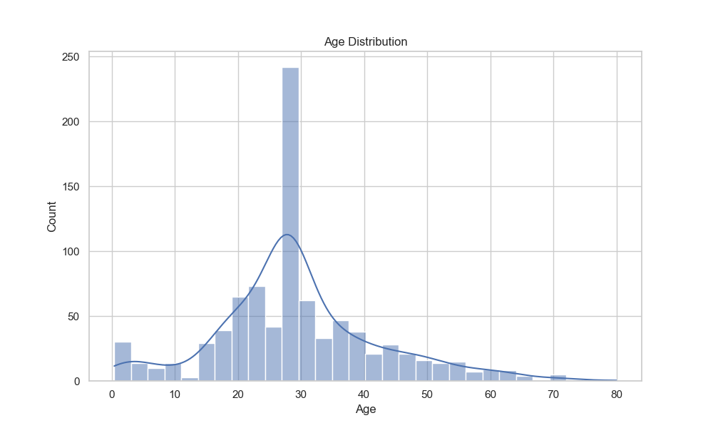
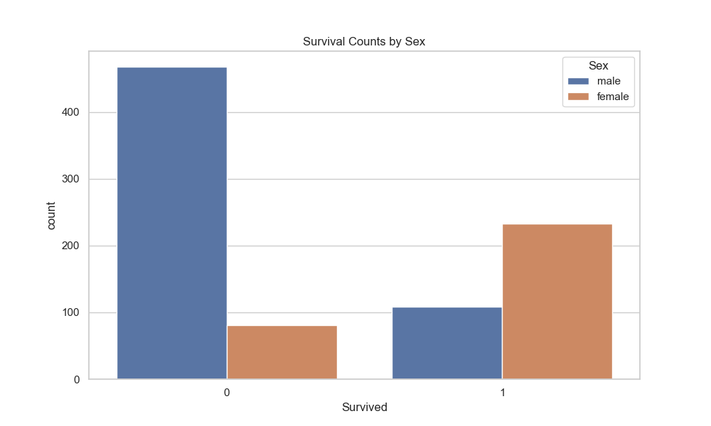

# 🚢 Titanic Survival Prediction (Data Science) Project 

This Python-based data science project analyses passenger data from the Titanic disaster to predict survival using data preprocessing, Exploratory Data Analysis (EDA), and machine learning. The code is structured for use in **vscode** and consists of modular `.py` script files.

---

## 🧠 Objective

Explore and model the Titanic dataset to identify key features affecting survival and build a machine learning model for prediction. This project uses the [Kaggle Titanic dataset](https://www.kaggle.com/c/titanic/data) to explore data cleaning, visualization, and machine learning for survival prediction.

---

## 🗂️ Project Structure

```
titanic_survival_project/
├── data/
│   └── titanic.csv             # Place original dataset here
│   └── titanic_cleaned.csv     # Output of cleaning script
├── figures/
│   └── age_distribution.png    
│   └── survival_by_sex.png  
├── models/
│   └── encoder_embarked.pkl            
│   └── encoder_sex.pkl 
│   └── logistics_model.pkl
├── src/
│   ├── data_cleaning.py
│   ├── exploratory_analysis.py
│   └── model_training.py
│   └── utils.py
├── .gitignore
├── power_point_presentation.py
├── README.md
├── requirements.txt
└── Titanic_Survival_Prediction_Project.pptx

```

---

## 🛠️ Technologies Used

- Python 3.8+
- pandas, numpy
- seaborn, matplotlib
- scikit-learn, joblib
- powerpoint
- csv file
- vscode

---

## 🚀 Setup Instructions

1. **Clone the repository**

```
https://github.com/AAdewunmi/titanic_survival_project.git
```

2. **Create a virtual environment (macOS/Linux)**

```bash
# Set up virtual environment
python3 -m venv venv
source venv/bin/activate    # On Windows: venv\Scripts\activate

# Install dependencies
pip install -r requirements.txt

# Run scripts
python src/data_cleaning.py
python src/eda.py
python src/model.py
```

---
## 📊 Project Workflow

### 1. Data Exploration & Cleaning
- Dropped columns with excessive missing values (`deck`, `embark_town`)
- Filled missing age values with the median
- Encoded categorical variables like `sex` and `embarked`

### 2. Exploratory Data Analysis (EDA)
- Visualized survival rates by gender and class
- Created a correlation heatmap
- Discovered that `sex`, `pclass`, and `fare` are strong indicators of survival

### 3. Feature Engineering
Selected key features:
- `pclass`, `sex`, `age`, `sibsp`, `parch`, `fare`, `embarked`

### 4. Model Training
- Used `RandomForestClassifier` from scikit-learn
- Trained and tested the model using an 80/20 train-test split

### 5. Evaluation
- Achieved ~80% accuracy
- Evaluated with precision, recall, and F1 score
- Visualized feature importance

### 6. Results
- Gender (`sex`) and class (`pclass`) were the most influential features.
- Model demonstrated good generalization on unseen data.
- The logistic regression model achieved an accuracy of 0.8101 on the test set. This means the model correctly predicted survival for about 81% of passengers.

---

## 📌 Power Point Presentation


Here is a link to a power point presentation detailing the key findings of the project. 

It's been created using "power_point_presentation.py".


[Titanic Survival Prediction Project](Titanic_Survival_Prediction_Project.pptx)


---

## 📈 Visualizations

- Age Distribution
  


- Survival by Gender
  


---

## 🚀 Next Steps (Potential Improvements)

* Explore other classification models (e.g., Random Forest, Support Vector Machines).
* Perform feature scaling and selection.
* Conduct more in-depth EDA.
* Fine-tune the model hyperparameters.

---
## 📬 Contact
If you have questions or suggestions, feel free to reach out or open an issue.

---

## 👤 Author

Adrian Adewunmi – [GitHub](https://github.com/AAdewunmi)
